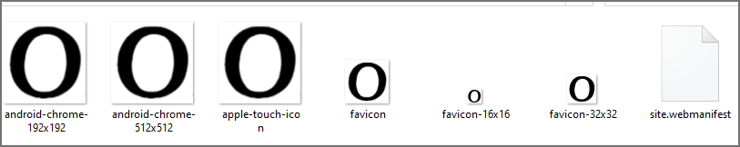

# Oppkey Web Site Theme Evaluation

Assessment of [Sparrow theme](https://prium.github.io/twbs-sparrow/v2.1.0/)
for new Oppkey design.

[live site](https://oppkey.github.io)

- Sparrow version 2.1.0

## people

### section navigation

| HTML id  | url |
| -------- | ------ |
| `#top`   | [https://oppkey.github.io/pages/people.html#top](https://oppkey.github.io/pages/people.html#top) |
| `#founders` | [https://oppkey.github.io/pages/people.html#founders](https://oppkey.github.io/pages/people.html#founders)   |
| `#oppkeynetwork` | [https://oppkey.github.io/pages/people.html#oppkeynetwork](https://oppkey.github.io/pages/people.html#oppkeynetwork)  | 
| `#slack` | [https://oppkey.github.io/pages/people.html#slack](https://oppkey.github.io/pages/people.html#slack) |
| `#board` | [https://oppkey.github.io/pages/people.html#board](https://oppkey.github.io/pages/people.html#board) |

## logo variants

| | | 
| ------ | ---- |
|  |   |
|  |  |

## favicon

* used [favicon-converter](https://favicon.io/favicon-converter/)

# Force deployment refresh
