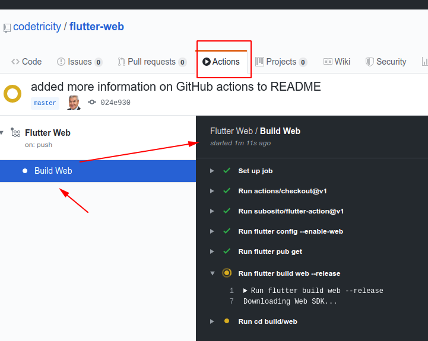

# Flutter Web Example for Oppkey

[Live Site](https://codetricity.github.io/flutter-web/#/)

Demonstration of Flutter Web for evaluation of new Oppkey site. 
This site is built with Flutter, not HTML, CSS, or JavaScript. 
I didn't use templates like Bootstrap.

Responsive changes between desktop and mobile are handled with Flutter.

## Desktop

## Mobile

## Flutter web reference

* [Official Flutter for Web Getting Started](https://flutter.dev/docs/get-started/web)

## Other strategies

* [responsive_grid](https://pub.dev/packages/responsive_grid#-readme-tab-)
* [Medium article using above](https://medium.com/flutter-community/build-your-responsive-flutter-layout-like-a-pro-6bf86aaed81e)

## GitHub Actions

* [GitHub Actions for Flutter Web and GitHub Pages](https://medium.com/flutter-community/flutter-web-github-actions-github-pages-dec8f308542a) by Onat Cipli
* [Flutter action](https://github.com/marketplace/actions/flutter-action) on GitHub marketplace
* [Configuring GitHub actions](https://help.github.com/en/actions/configuring-and-managing-workflows/configuring-a-workflow) - official GitHub documentation
* [GitHub Actions blog post from Aug 8, 2019](https://github.blog/2019-08-08-github-actions-now-supports-ci-cd/)

## Assets and Fonts

* Rubik https://fonts.google.com/specimen/Rubik

Image https://icons8.com/ouch/illustration/flame-success

Artist: [Thierry Fousse](https://dribbble.com/thierryfousse)

## References

using VS Code.

https://youtu.be/rpkKYQCioW0